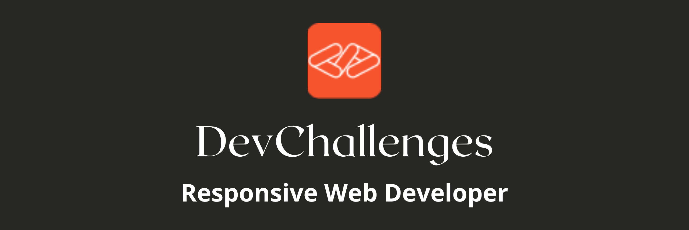

<!-- Please update value in the {}  -->

<h1 align="center">{404 not found}</h1>

   Solution for a challenge from  <a href="http://devchallenges.io" target="_blank">Devchallenges.io</a>.

  <h3>
    <a href="https://404-not-found-lac.vercel.app/">
      Demo
    </a>
     | 
    <a href="https://devchallenges.io/solutions/wj2lX9ucBN0owt336AOM">
      Solution
    </a>
     | 
    <a href="https://devchallenges.io/challenges/wBunSb7FPrIepJZAg0sY">
      Challenge
    </a>
  </h3>

<!-- TABLE OF CONTENTS -->

## Table of Contents

- [Overview](#overview)
  - [Built With](#built-with)
- [Features](#features)
- [Acknowledgements](#acknowledgements)
- [Contact](#contact)

<!-- OVERVIEW -->

## Overview

- You can see a demo at [404-not-found](https://404-not-found-lac.vercel.app/)
- This is my first challenge on DevChallenges. 
- It's the first time I use Figma as a reference to develop a design.
- I hope to improve my skills on frontend development.

### Built With

<!-- This section should list any major frameworks that you built your project using. Here are a few examples.-->

- [Sass](https://sass-lang.com/)

## Features

<!-- List the features of your application or follow the template. Don't share the figma file here :) -->

This application/site was created as a submission to a [DevChallenges](https://devchallenges.io/challenges) challenge. The [challenge](https://devchallenges.io/challenges/wBunSb7FPrIepJZAg0sY) was to build an application to complete the given user stories.

## Acknowledgements

<!-- This section should list any articles or add-ons/plugins that helps you to complete the project. This is optional but it will help you in the future. For exmpale -->

- [Steps to replicate a design with only HTML and CSS](https://devchallenges-blogs.web.app/how-to-replicate-design/)
- [Marked - a markdown parser](https://github.com/chjj/marked)

## Contact

- GitHub [@Aman-sgz](https://github.com/Aman-sgz)
